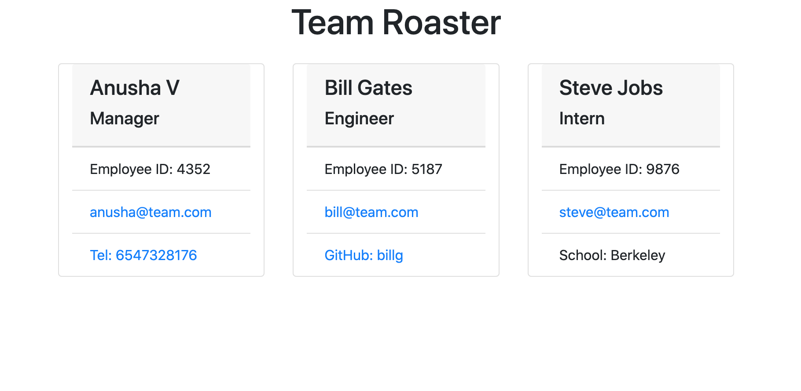

# Team Roaster

Team Roaster  is a command-line application run in Node that requests information from the user about members of an engineering team and generates an HTML file to present the team in user friendly way. This project demonstrates use of OOP and TDD using Jest.

## Installation
                        
README generator is Node.js application. You’ll be required to have Node.js installed to run the application.  Once you have Node.js installed, clone this repository and run `npm i`  from the project directory to install required Node modules.

## Usage

To start the command-line application run `npm run start`.

Once the application is started, First enter the team manager information followed by the members of the team (Engineers and Intern). View walk through video [here](https://drive.google.com/file/d/1qu2g10BtUxDEJnNem1yZppMW3fkG1Cnt/view).

## Tests

Use `npm run test` command to run unit tests.